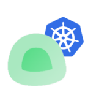

<div align="center" width="100%">
    
</div>

<p align="center">
  
</p>

<div align="center" width="100%">
    <p>
        <a href="https://github.com/Jasonrve/uptime-kuma-operator/actions"></a>
        <a href="https://github.com/Jasonrve/uptime-kuma-operator/releases/latest"></a>
        <a href="https://github.com/Jasonrve/uptime-kuma-operator/pkgs/container/uptime-kuma-operator">
          
        </a>
                
        
        
    </p>
</div>

# Uptime Kuma Operator

Uptime Kuma Operator automatically registers Uptime Kuma monitors and applies a GitOps approach to monitor registration.


##### Identifiers
Uptime items are displayed by tags. These items are managed by the operator. Any other items you create will not be managed by the operator.


There are two types of tags:
 * **ingress**: These are registered from Kubernetes items
 * **crd**: These are registered through Kubernetes-defined resources

## ⭐ Features
 * Auto sync all ingress
 * Add registration via `app.uptimekuma/name` annotation
 * Dashboard support
 * Generic monitor support
 * Export via CRD
 * Automatic username and password registration
 * Support for deploying Uptime Kuma or pointing to an existing one
 * Synchronization job

## 🚧 Coming Features
 * Notification registration support
 * Export via simple tag addition
 * Agent-based deployment for multiple clusters


##### What this is not
This is not for Docker. If you want to use Docker, check out [AutoKuma 🐻](https://github.com/BigBoot/AutoKuma). It's a great project.


## 🔧 How to Install

## 🐳 Kubernetes

To install Uptime Kuma Operator on Kubernetes, you can use the Helm chart available in the `/charts/uptime-kuma-operator` folder.

### Prerequisites

- Kubernetes 1.12+
- Helm 3.1.0

### Install

1. Add the Helm repository:

  ```bash
  helm repo add uptime-kuma-operator https://jasonrve.github.io/helm-charts
  helm repo update
  ```

2. Install the chart:

  ```bash
  helm install my-release uptime-kuma-operator/uptime-kuma-operator
  ```

## Configuration

The following table lists the default configurable parameters of the Uptime Kuma Operator chart and their default values.

| Parameter | Description | Default |
| --------- | ----------- | ------- |
| `kuma_load_all_ingress` | Loads all ingress resources, even if the annotation is not set | `true` |
| `replicaCount` | Number of Uptime Kuma Operator replicas to deploy | `1` |
| `uptimekuma.password` | The password for Uptime Kuma | `password` |
| `uptimekuma.username` | The username for Uptime Kuma | `admin` |

You can override these values by providing your own `values.yaml` file or by using the `--set` flag. For example:

# How to register ingress items for Uptime Kuma
Three options


1) Annotate an ingress with the following annotation and it will be registered:

```yaml
kind: Ingress
metadata:
  annotations:
    app.uptimekuma/name: "my-very-cool-ingress"
```


2) `kuma_load_all_ingress` setting
  You can set this in the values to register all ingress resources.


3) Monitors can be registered via CRDs:
  - HttpMonitor (Only supports HTTP-related registrations. Not complex, straightforward.)
  - GenericMonitor (For advanced registrations; supports all types of monitors.)


# Dashboard Management

Dashboards are managed by CRDs and are a collection of dashboard names to build out dashboards (names can be from either GenericMonitor or HttpMonitor).

``` yaml
apiVersion: uptime.kuma/v1
kind: Dashboard
metadata:
  name: "example-dashboard"
  namespace: default
spec:
  description: "This is an example dashboard"
  group:
    - monitorList:
        - GenericMonitorOne
        - HttpMonitorTwo
      name: myFancyGroupName
      weight: 0
```


# Credits
 * Credit to [louislam](https://github.com/louislam) for use of [uptime-kuma](https://github.com/louislam/uptime-kuma)
 * Credit to [buehler](https://github.com/buehler) for use of [dotnet-operator-sdk](https://github.com/buehler/dotnet-operator-sdk)
 * Credit to [dirsigler](https://github.com/dirsigler) for subchart of [uptime-kuma-helm](https://github.com/dirsigler/uptime-kuma-helm)